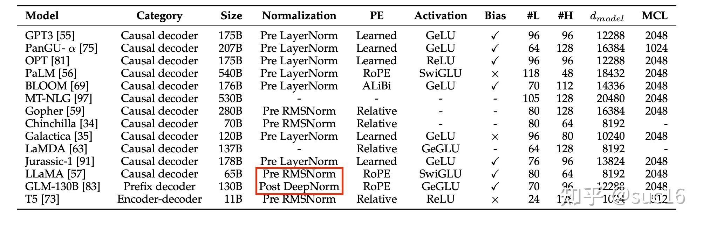

## 目前国内的常见的大模型类型
根据以上搜索结果,目前主流的开源大模型体系包括:

1. LLaMA - Meta发布的大语言模型系列,有70亿、130亿、330亿和650亿参数规模的模型。LLaMA-13B在性能上可以超过GPT-3[9]。

2. Alpaca、Vicuna等在LLaMA基础上进行指令微调的模型[9][14]。

3. BLOOM - 由BigScience发布的176B参数多语言开源模型[9]。

4. GLM - 清华大学发布的双语(中英)预训练语言模型系列,最大规模达1300亿参数[9][13]。

5. ChatGLM - 清华大学KEG实验室发布的支持中英双语的对话语言模型,基于 General Language Model (GLM) 架构[13]。

6. MOSS - 复旦大学发布的支持中英双语的开源对话语言模型,最大规模160B参数[14]。

7. 悟道 - 智谱AI发布的双语多模态预训练模型,包括图文模型CogView、BriVL和语言模型GLM等[9]。

8. 盘古α - 华为诺亚方舟实验室发布的大规模中英文预训练语言模型,最大规模达200B参数[13]。

9. 通义千问 - 阿里达摩院发布的中文大规模语言模型,基于自研的混合专家-MoE技术[14]。

10. CPM系列 - 鹏城实验室发布的中英文预训练语言模型,如CPM-1、CPM-2、EVA等[14]。

此外还有一些如Megatron-LM、GPT-J、OPT、T5、FLAN-T5等由科技公司和研究机构开源的大模型。这些模型大多基于Transformer架构,通过在大规模语料上预训练,可以应用于对话、问答、摘要、写作等多种自然语言任务。开源社区也基于这些模型进行了大量的微调和应用拓展。

## 常见推理架构

### vLLM

vLLM 运行大模型非常快，主要使用以下方法实现：

- **先进的服务吞吐量**：vLLM 提供了最先进的服务吞吐量，能够处理大量并发请求。
- **PagedAttention**：通过 PagedAttention 对 attention key 和 value 内存进行有效管理，减少内存占用并提高效率[1][2]。
- **连续批处理**：对输入请求进行连续批处理，优化处理速度和资源利用率[1][2]。
- **高度优化的 CUDA 内核**：使用高度优化的 CUDA 内核来加速模型执行，确保高效的推理性能[1][2]。

### OpenLLM

OpenLLM 运行大模型非常快，主要使用以下方法实现：

- **促进实际生产过程中的大模型的部署、微调、服务和监测**：OpenLLM 提供了一个开放平台，支持大模型的部署、微调、服务和监测，简化了大模型在生产环境中的使用[6][7]。
- **灵活的 API**：提供 RESTful API 和 gRPC 接口，支持多种查询方式，方便集成和使用[6][7]。
- **与 BentoML 和 LangChain 的集成**：支持与 BentoML 和 LangChain 的无缝集成，允许用户轻松创建和部署复杂的 AI 应用[6][7]。

### DeepSpeed-MII

DeepSpeed-MII 运行大模型非常快，主要使用以下方法实现：

- **MII (Model Implementations for Inference)**：提供加速的文本生成推理，通过以下技术实现高效推理[11][12]：
  - **Blocked KV Caching**：优化缓存机制，提高推理速度[11][12]。
  - **Continuous Batching**：连续批处理请求，减少延迟并提高吞吐量[11][12]。
  - **Dynamic SplitFuse**：动态分割和融合计算，提高计算效率[11][12]。
  - **高性能的 CUDA 内核**：使用高性能的 CUDA 内核来加速推理过程[11][12]。

### TensorRT-LLM

TensorRT-LLM 运行大模型非常快，主要使用以下方法实现：

- **组装优化大语言模型推理解决方案的工具**：提供一个工具箱，用于组装和优化大语言模型的推理解决方案[15][16]。
- **Python API**：提供易于使用的 Python API 来定义大模型，并为 NVIDIA GPU 编译高效的 TensorRT 引擎[15][16]。
- **量化技术**：支持 INT4 和 INT8 权重量化，以及 FP8 格式，减少内存占用并提高推理速度[15][16]。
- **多 GPU 和多节点支持**：支持多 GPU 和多节点的并行计算，提高推理性能和扩展性[15][16]。

通过这些方法和技术，这些平台能够显著提高大模型的推理速度和效率，满足实际生产环境中的高性能需求。### vLLM

vLLM 运行大模型非常快，主要使用以下方法实现：

- **先进的服务吞吐量**：vLLM 提供了最先进的服务吞吐量，能够处理大量并发请求。
- **PagedAttention**：通过 PagedAttention 对 attention key 和 value 内存进行有效管理，减少内存占用并提高效率[1][2]。
- **连续批处理**：对输入请求进行连续批处理，优化处理速度和资源利用率[1][2]。
- **高度优化的 CUDA 内核**：使用高度优化的 CUDA 内核来加速模型执行，确保高效的推理性能[1][2]。

### OpenLLM

OpenLLM 运行大模型非常快，主要使用以下方法实现：

- **促进实际生产过程中的大模型的部署、微调、服务和监测**：OpenLLM 提供了一个开放平台，支持大模型的部署、微调、服务和监测，简化了大模型在生产环境中的使用[6][7]。
- **灵活的 API**：提供 RESTful API 和 gRPC 接口，支持多种查询方式，方便集成和使用[6][7]。
- **与 BentoML 和 LangChain 的集成**：支持与 BentoML 和 LangChain 的无缝集成，允许用户轻松创建和部署复杂的 AI 应用[6][7]。

### DeepSpeed-MII

DeepSpeed-MII 运行大模型非常快，主要使用以下方法实现：

- **MII (Model Implementations for Inference)**：提供加速的文本生成推理，通过以下技术实现高效推理[11][12]：
  - **Blocked KV Caching**：优化缓存机制，提高推理速度[11][12]。
  - **Continuous Batching**：连续批处理请求，减少延迟并提高吞吐量[11][12]。
  - **Dynamic SplitFuse**：动态分割和融合计算，提高计算效率[11][12]。
  - **高性能的 CUDA 内核**：使用高性能的 CUDA 内核来加速推理过程[11][12]。

### TensorRT-LLM

TensorRT-LLM 运行大模型非常快，主要使用以下方法实现：

- **组装优化大语言模型推理解决方案的工具**：提供一个工具箱，用于组装和优化大语言模型的推理解决方案[15][16]。
- **Python API**：提供易于使用的 Python API 来定义大模型，并为 NVIDIA GPU 编译高效的 TensorRT 引擎[15][16]。
- **量化技术**：支持 INT4 和 INT8 权重量化，以及 FP8 格式，减少内存占用并提高推理速度[15][16]。
- **多 GPU 和多节点支持**：支持多 GPU 和多节点的并行计算，提高推理性能和扩展性[15][16]。

通过这些方法和技术，这些平台能够显著提高大模型的推理速度和效率，满足实际生产环境中的高性能需求。

Citations:
[1] https://github.com/vllm-project/vllm
[2] https://vllm.readthedocs.io/_/downloads/en/latest/pdf/
[3] https://blog.vllm.ai/2023/06/20/vllm.html
[4] https://docs.vllm.ai/en/latest/getting_started/quickstart.html
[5] https://docs.bentoml.com/en/latest/use-cases/large-language-models/vllm.html
[6] https://pypi.org/project/openllm/0.1.2/
[7] https://www.bentoml.com/blog/announcing-open-llm-an-open-source-platform-for-running-large-language-models-in-production
[8] https://rocm.blogs.amd.com/artificial-intelligence/openllm/README.html
[9] https://docs.bentoml.org/en/latest/quickstarts/deploy-a-large-language-model-with-openllm-and-bentoml.html
[10] https://bentoml.com/blog/openllm-in-action-part-1-understanding-the-basics-of-openllm
[11] https://github.com/microsoft/DeepSpeed-MII
[12] https://www.microsoft.com/en-us/research/project/deepspeed/deepspeed-mii/
[13] https://towardsdatascience.com/deepspeed-deep-dive-model-implementations-for-inference-mii-b02aa5d5e7f7
[14] https://github.com/microsoft/DeepSpeed-MII/blob/main/mii/legacy/README.md
[15] https://github.com/NVIDIA/TensorRT-LLM
[16] https://developer.nvidia.com/tensorrt
[17] https://nvidia.github.io/TensorRT-LLM/
[18] https://developer.nvidia.com/blog/nvidia-tensorrt-llm-supercharges-large-language-model-inference-on-nvidia-h100-gpus/

## 常见集成学习方法回顾
根据以上搜索结果,我总结了常见的集成学习方法及其基本思想如下:

1. Bagging (Bootstrap Aggregating)
- 基本思想:从原始数据集中采用有放回抽样的方式构造多个训练子集,分别训练多个基学习器,然后将这些学习器的预测结果进行简单平均或加权平均作为最终预测。
- 代表算法:随机森林(Random Forest)
- 特点:可以并行训练,减少模型的方差,避免过拟合。

2. Boosting
- 基本思想:通过迭代训练一系列弱学习器,每次根据上一轮弱学习器的表现调整训练样本的权重,使得先前分类错误的样本在后续受到更多关注。最后将各个弱学习器的结果加权组合作为最终预测。
- 代表算法:AdaBoost, Gradient Boosting
- 特点:可以串行训练,减少模型的偏差,将弱学习器提升为强学习器。

3. Stacking
- 基本思想:将多个不同类型的学习算法组合,分为两层。第一层由多个基学习器组成,其输出结果作为第二层的输入特征,第二层的学习器根据这些特征做出最终预测。
- 特点:结合了多个异质模型,需要避免过拟合,训练过程相对复杂。

4. Voting
- 基本思想:对多个学习器的预测结果进行投票,得票最多的类别作为最终预测。可分为绝对多数投票、相对多数投票、加权投票等。
- 特点:直接利用多个模型的预测结果,实现简单。

5. Blending
- 基本思想:将数据划分为训练集和验证集,用训练集训练多个基学习器,然后用验证集去训练一个组合器,基于验证集上基学习器的预测结果,得到组合策略。
- 特点:引入验证集避免过拟合,但会减少训练数据。

总的来说,集成学习通过构建并结合多个学习器,利用单个学习器的优点,克服其缺点,从而获得比单个学习器显著优越的性能。不同的集成策略在学习器的构建方式、结合方式等方面各有特点。在实践中,要根据具体问题和数据特点,权衡集成的模型复杂度、训练开销和性能提升,选择合适的集成学习方法。

Citations:
[1] https://www.jiqizhixin.com/articles/2019-05-15-15
[2] https://www.cnblogs.com/ZihanZhang/p/16351469.html
[3] https://www.jiqizhixin.com/articles/2018-12-28-11
[4] https://blog.csdn.net/zwqjoy/article/details/80431496
[5] https://leovan.me/cn/2018/12/ensemble-learning/
[6] https://blog.csdn.net/weixin_39948381/article/details/106442535
[7] https://fuxi.163.com/database/694
[8] https://www.jiqizhixin.com/graph/technologies/29722de0-8501-4b01-9b73-189141b9eefd
[9] https://wfwei.github.io/posts/ensemble-methods/
[10] http://sklearn123.com/ThirdSection/1.11.Ensemble%20methods/
[11] https://shmc.tongji.edu.cn/88/6f/c32676a297071/page.htm
[12] https://developer.baidu.com/article/details/3141963

## 推导反向传播
反向传播算法（Backpropagation）是训练神经网络中最核心的算法之一，它通过计算损失函数相对于网络参数的梯度来更新网络的权重，以此最小化损失函数。反向传播算法的推导基于链式法则，以下是其基本步骤和推导过程：

1. **前向传播**：首先，网络进行前向传播，计算出每一层的输出值。对于一个简单的三层神经网络，输入层到隐藏层的计算可以表示为 $$z^{[1]} = W^{[1]}x + b^{[1]}$$，其中 $$x$$ 是输入，$$W^{[1]}$$ 和 $$b^{[1]}$$ 分别是权重和偏置，$$z^{[1]}$$ 是加权输入。激活函数应用于 $$z^{[1]}$$ 得到隐藏层的输出 $$a^{[1]} = \sigma(z^{[1]})$$，其中 $$\sigma$$ 是激活函数[4]。

2. **计算损失**：在网络的最后一层，计算预测输出与实际标签之间的损失。损失函数 $$L$$ 可以是均方误差、交叉熵等。

3. **反向传播误差**：反向传播的核心是计算损失函数相对于每个参数的梯度。这个过程从输出层开始，逆向通过网络进行。

    - 对于输出层，计算损失函数 $$L$$ 相对于激活函数输出的梯度 $$\frac{\partial L}{\partial a^{[L]}}$$。然后，根据链式法则，计算损失函数相对于加权输入的梯度 $$\frac{\partial L}{\partial z^{[L]}} = \frac{\partial L}{\partial a^{[L]}} \cdot \frac{\partial a^{[L]}}{\partial z^{[L]}}$$，其中 $$\frac{\partial a^{[L]}}{\partial z^{[L]}}$$ 是激活函数的导数[4][7]。

    - 接下来，计算损失函数相对于权重和偏置的梯度 $$\frac{\partial L}{\partial W^{[L]}}$$ 和 $$\frac{\partial L}{\partial b^{[L]}}$$。这些梯度可以用来更新权重和偏置：$$W^{[L]} = W^{[L]} - \alpha \frac{\partial L}{\partial W^{[L]}}$$，$$b^{[L]} = b^{[L]} - \alpha \frac{\partial L}{\partial b^{[L]}}$$，其中 $$\alpha$$ 是学习率[4][7]。

4. **反向传播到隐藏层**：对于隐藏层，需要计算损失函数相对于隐藏层输出的梯度，然后重复上述过程。对于第 $$l$$ 层，误差项 $$\delta^{[l]}$$ 可以表示为下一层的误差项 $$\delta^{[l+1]}$$ 乘以当前层权重的转置，再乘以当前层激活函数的导数：$$\delta^{[l]} = ((W^{[l+1]})^T \delta^{[l+1]}) \cdot \sigma'(z^{[l]})$$[4][7]。

5. **权重更新**：最后，使用计算出的梯度更新每一层的权重和偏置。

反向传播算法的关键在于利用链式法则逐层计算梯度，并更新权重以最小化损失函数。这个过程需要对每一层进行迭代，直到达到预定的迭代次数或损失函数收敛到一个小值。

## 大模型微调

大模型微调主要包括以下几种类型：

1. **参数微调**：对预训练模型的参数进行微调，以适应特定领域的数据和任务[2]。
2. **特征微调**：通过修改预训练模型的输入特征来适应特定领域的方法[2]。
3. **结构微调**：对预训练模型的结构进行修改，以适应特定领域的需求[2]。
4. **全微调**：对整个预训练模型进行微调[3]。
5. **部分微调**：仅更新模型的顶层或一小部分中间层的参数，保留大部分或全部底层预训练模型参数不变[3]。

### P-tuning 和 SFT 之间的区别

**P-tuning** 和 **SFT**（监督微调）是两种不同的微调方法：

- **P-tuning**：
  - **定义**：P-tuning 是一种参数高效的微调方法，主要通过在输入前缀上进行微调来调整模型的表现[4]。
  - **特点**：P-tuning v2 是对 P-tuning v1 的改进，旨在减少微调所需的参数量和计算资源[4]。
  - **应用**：适用于需要高效微调的大模型，减少资源消耗[4]。

- **SFT（监督微调）**：
  - **定义**：SFT 是一种传统的监督微调方法，通过对预训练模型的全量参数进行微调来适应特定任务[4]。
  - **特点**：SFT 需要大量的资源和时间，因为它涉及对整个模型参数的调整[4]。
  - **应用**：适用于需要高精度调整的任务，但资源消耗较大[4]。

总结来说，P-tuning 更加注重参数和计算资源的高效利用，而 SFT 则是对模型进行全面的参数调整，适用于需要精细调整的任务。

## SFT的常见量化方法、不同量化方法之间的区别？

### RAG项目的主要问题，如何进行解决？

​      1. RAG项目的场景需要定义在用户的问题能够通过部分语料进行知识补充的角度上，需要在项目开始前，就对场景有所评估，是否有足够的数据（或可以生成数据）作为知识补充，使得用户的问题能够在部分的语料的辅佐下得到正确的回答；

	2. 用户Query对语料库的语义命中率低，通过对既有语料，找到一些合适的用户询问角度，采用LLM模拟真实用户模拟问答对，或模拟业务对应的说明来补充数据量；可以在用户输入时 / 输入后采用RAG搜索相关语料，并且推测相关问题；
	2. 语料段的处理 合适的chunk和分割策略，既有语料的局部分割，对不同类型的数据率先进行分类等； 
	2. 用户问询本身并不准确 LLM补充，多轮问询策略
	2. 基于SFT的RAG补充，利用LLM本身的泛化能力使得首答的准确率上升，以及SFT之后的模型的response对于Corpus的命中率更高的特点

## 大模型为什么会乱说话

大模型会出现“乱说话”现象，主要原因包括以下几个方面：

1. **数据分布不一致**：训练数据与实际应用场景存在显著差异，导致模型学到的特征在实际应用中不适用，从而生成不准确的内容[1]。
2. **过拟合**：大型模型的参数量庞大，容易在训练数据上产生过拟合，即过分适应噪声或非代表性数据，这并不一定反映真实场景[1]。
3. **标签噪声**：训练数据中的错误标签可能导致模型学到错误的知识，进而生成与实际情况不符的内容[1]。
4. **统计关联而非逻辑推理**：大模型如ChatGPT通过概率最大化生成数据，而不是通过逻辑推理生成回复，这种方法容易导致虚假关联和拼凑的结果[1]。

### 解决大模型“幻觉”问题的方法

1. **数据清洗与增强**：清理数据集中的噪声和异常值，提高训练数据的质量，同时采用数据增强技术生成更多多样性的训练样本，以提高模型的泛化能力[1]。
2. **正则化技术**：引入权重衰减、Dropout等正则化技术，减少模型的复杂度，防止过拟合[1]。
3. **交叉验证**：通过交叉验证评估模型在不同子集上的性能，防止模型在特定数据集上过度优化，增强模型的泛化能力[1]。
4. **迁移学习**：在其他任务上预训练模型，将先验知识引入目标任务，避免在训练过程中过分适应训练数据[1]。

这些方法可以帮助减少大模型生成虚假或误导性内容的概率，提高其在实际应用中的可靠性和准确性。

## 什么是Paged Attention? 

PagedAttention是一种旨在显著减少大语言模型（LLM）中键值缓存（KV cache）内存占用的技术。其核心思想是将每个序列的KV缓存划分为更小、更易管理的“页”或块。每个块包含固定数量的令牌的键值向量，这样可以在注意力计算过程中更高效地加载和访问KV缓存[1][2]。

PagedAttention的内存管理方式类似于操作系统中的虚拟内存管理。它将数据的逻辑组织与物理存储分离，通过块表将序列的逻辑块映射到可能不连续的物理块。这种抽象允许更灵活的内存利用，当生成新令牌时，可以分配新的物理块[1][2]。

### PagedAttention在大语言模型中的应用

PagedAttention在大语言模型中的应用主要体现在以下几个方面：

1. **内存管理**：
   - **非连续内存存储**：PagedAttention允许将KV块存储在非连续的物理内存中，从而实现更灵活的分页内存管理。这种方法减少了内存碎片，提高了内存利用率[2][3]。
   - **动态内存分配**：通过动态分配内存块，PagedAttention可以根据需要增长内存使用量，避免了静态内存分配带来的浪费[5]。

2. **高效的注意力计算**：
   - **块级注意力计算**：在注意力计算过程中，PagedAttention内核识别并分别获取不同的KV块，从而提高计算效率[2]。
   - **并行采样和束搜索**：PagedAttention在并行采样和束搜索中可以重用块，减少内存开销。例如，在束搜索中，PagedAttention可以在多个搜索路径之间重用块，从而降低内存使用[3][5]。

3. **共享前缀提示**：
   - **系统提示重用**：在许多情况下，用户会提供一个适用于所有任务的“系统”提示。PagedAttention允许为这部分提示分配的块在多个请求之间重用，从而减少内存使用[3][5]。

4. **分布式执行**：
   - **vLLM系统**：PagedAttention被集成到vLLM系统中，该系统包含调度器、KV缓存管理器、工作节点（包含GPU硬件的计算机）和块分配器。vLLM系统通过这些组件实现高效的分布式执行和内存管理[3][5]。

### 结论

PagedAttention通过将KV缓存划分为更小的块并利用查找表进行高效访问，显著减少了大语言模型的内存占用。这种技术不仅提高了内存利用率，还增强了模型的吞吐量和响应速度，使得大语言模型在实际应用中更加高效和可扩展[1][2][3][5]。

Citations:
[1] https://www.hopsworks.ai/dictionary/pagedattention
[2] https://arxiv.org/pdf/2309.06180.pdf
[3] https://newsletter.micahlerner.com/p/paper-review-efficient-memory-management
[4] https://www.modular.com/ai-resources/efficient-memory-management-for-large-language-model-serving-with-pagedattention
[5] https://www.micahlerner.com/2024/01/11/efficient-memory-management-for-large-language-model-serving-with-pagedattention.html

### 与Paged Attention对比的是什么样的方法？为什么Paged Attention更有效？

#### 传统的静态内存分配方法

1. **固定大小的内存分配**：
   - 传统的静态内存分配方法在编译时确定内存大小，并且在程序运行期间无法更改。这意味着即使程序只需要一部分内存，整个预分配的内存块仍然会被占用，导致内存浪费[1][2][3]。
   - 例如，在处理最大长度为2048的序列时，即使实际输入序列较短，系统也会为每个请求预留2048的内存空间，导致大量未使用的内存被浪费[6]。

2. **内存碎片化**：
   - 静态内存分配容易导致内存碎片化，特别是在处理动态增长和缩减的KV缓存时。这种碎片化会进一步降低内存利用率，增加显存的负担[1][2][3]。

3. **内存利用率低**：
   - 由于静态内存分配无法动态调整内存大小，未使用的内存部分无法被其他进程或任务利用，导致内存利用率低[1][2][3]。

#### Paged Attention的特点和优势

1. **动态内存分配**：
   - Paged Attention在运行时动态分配内存，存储的是生成过程中每个令牌的键值对。这种动态分配方式使得内存使用更加灵活和高效[4][5][6]。
   - Paged Attention通过将KV缓存划分为更小的块（页），并利用查找表进行高效访问，显著减少了内存浪费[5][6][7]。

2. **内存优化技术**：
   - Paged Attention允许将连续的键值对存储在非连续的物理内存中，从而实现更灵活的分页内存管理。这种方法减少了内存碎片，提高了内存利用率[5][6][7]。
   - 通过动态分配内存块，Paged Attention可以根据需要增长内存使用量，避免了静态内存分配带来的浪费[5][6][7]。

3. **缓存机制**：
   - KV Cache通过缓存之前计算的键值对，避免了重复计算，从而减少了计算开销和内存使用。这种缓存机制使得每次生成新令牌时只需计算当前令牌的键值对，而不需要重新计算所有之前的键值对[4][5][6]。

4. **高效的注意力计算**：
   - Paged Attention在注意力计算过程中，内核识别并分别获取不同的KV块，从而提高计算效率[5][6][7]。
   - 例如，在束搜索中，Paged Attention可以在多个搜索路径之间重用块，从而降低内存使用[5][6][7]。

#### Paged Attention的具体应用

1. **内存管理**：
   - Paged Attention通过将KV缓存划分为更小的块，并利用查找表进行高效访问，显著减少了大语言模型的内存占用。这种方法不仅提高了内存利用率，还增强了模型的吞吐量和响应速度，使得大语言模型在实际应用中更加高效和可扩展[5][6][7]。

2. **分布式执行**：
   - Paged Attention被集成到vLLM系统中，该系统包含调度器、KV缓存管理器、工作节点（包含GPU硬件的计算机）和块分配器。vLLM系统通过这些组件实现高效的分布式执行和内存管理[5][6][7]。

3. **共享前缀提示**：
   - 在许多情况下，用户会提供一个适用于所有任务的“系统”提示。Paged Attention允许为这部分提示分配的块在多个请求之间重用，从而减少内存使用[5][6][7]。

### 结论

Paged Attention通过动态分配和缓存机制，能够更高效地利用内存资源，减少显存的负担。它通过将KV缓存划分为更小的块，并利用查找表进行高效访问，显著减少了内存浪费。这种方法不仅提高了内存利用率，还增强了模型的吞吐量和响应速度，使得大语言模型在实际应用中更加高效和可扩展[5][6][7]。

Citations:
[1] https://proceedings.neurips.cc/paper_files/paper/2017/file/3f5ee243547dee91fbd053c1c4a845aa-Paper.pdf
[2] https://aclanthology.org/W19-4808.pdf
[3] https://www.youtube.com/watch?v=2TT384U4vQg
[4] https://developer.nvidia.com/blog/emulating-the-attention-mechanism-in-transformer-models-with-a-fully-convolutional-network/
[5] https://docs.uipath.com/communications-mining/automation-cloud/latest/developer-guide/efficient-transformers-i-attention-mechanisms
[6] https://arxiv.org/abs/2210.00640
[7] https://arxiv.org/abs/2310.12442
[8] https://arxiv.org/html/2405.01814v1
[9] https://www.hopsworks.ai/dictionary/pagedattention
[10] https://www.youtube.com/watch?v=glyu_nQH0yw
[11] https://rocm.blogs.amd.com/artificial-intelligence/llm-inference-optimize/README.html
[12] https://arxiv.org/pdf/2309.06180.pdf

1. [LLaMA 模型](https://www.zhihu.com/search?q=LLaMA 模型&search_source=Entity&hybrid_search_source=Entity&hybrid_search_extra={"sourceType"%3A"article"%2C"sourceId"%3A"694374438"})为什么要用[旋转位置编码](https://www.zhihu.com/search?q=旋转位置编码&search_source=Entity&hybrid_search_source=Entity&hybrid_search_extra={"sourceType"%3A"article"%2C"sourceId"%3A"694374438"})？
2. 你训练的时候用 float16，还是[bfloat16](https://www.zhihu.com/search?q=bfloat16&search_source=Entity&hybrid_search_source=Entity&hybrid_search_extra={"sourceType"%3A"article"%2C"sourceId"%3A"694374438"})，float32？为什么？
3. 怎么解决训练使用float16导致溢出的问题？

## Multi-head Attention 和 Dot Product 的实现
hidden_states: shape [batch_size, hidden_size]
q, k, v proj matrix: shape [hidden_size, num_head*head_size]
o proj matrix: shape [num_head*head_size, hidden_size]

## 各种不同模型的范式 / 位置编码方法 / 激活函数 / Transformer层数 / 隐藏层之间的对比 

## [几种不同的分词方法和它们各自的特征](https://zhuanlan.zhihu.com/p/643829565) 